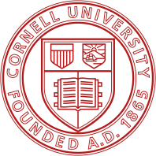

<h2>
About Me
</h2>

I am currently a junior student at Weiyang College, Tsinghua University, pursuing a dual major in Mathematics and Physics, as well as Civil Engineering and Systems.

In addition to my undergraduate coursework, I am fortunate to be mentored by Professor  [Kyra Gan](https://kyra-gan.github.io/), with whom I explore local discovery and hybrid global causal discovery with local search strategies. My research primarily centers on devising robust and efficient inference and causal discovery methods. More broadly, I am captivated by the challenge of constructing abstract mathematical models to address real-world problems and applying interpretable statistical techniques to data from physics, biology, social sciences, and engineering.

I am always open to engaging in discussions or forging new friendships. Please feel free to reach out to me via email if you share similar interests or simply wish to connect.

<h2>
Publications & Preprints
</h2>

**[Hybrid Global Causal Discovery with Local Search](https://arxiv.org/abs/2405.14496)**
 
Sujai Hiremath, Jacqueline R.M.A. Maasch, <u>Mengxiao Gao</u> , Promit Ghosal, Kyra Gan

<h2>
Education
</h2>

<table frame=void rules=none>
    <tr>
        <td width="15%">
             
            
        </td>
        <td>
             
            <b> Tsinghua University</b>
             
            2021.09-2025.06
             
            B.S. in Mathematics and Physics
            Double major in Civil Engineering and Systems     
        </td>
    </tr>
</table>

<table frame=void rules=none>
    <tr>
        <td width="15%">
             
            
        </td>
        <td>
             
            <b> Cornell University</b>
             
            2023.10-Present
             
            Research Intern
             
            Advisor: <a href="https://kyra-gan.github.io/">Kyra Gan</a>
             
            Mentor: <a href="https://sujaihiremath.github.io/">Sujai Hiremath</a>, Jacqueline Maasch
             
        </td>
    </tr>
</table>

<h2>
Miscellaneous
</h2>
I am very fond of puzzle-solving games. I enjoy watching and following tennis and figure skating. I have a deep appreciation for traditional Chinese music and classical poetry. While I am not particularly keen on sports, I greatly enjoy traveling and savoring local cuisines.
